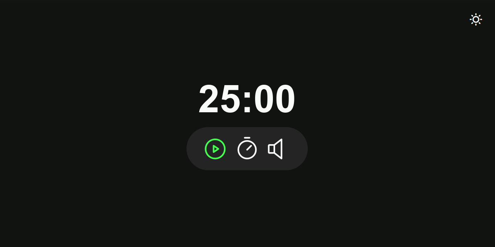

# Focus Timer - Pomodoro

Welcome to the Focus Timer - Pomodoro, a stylish timer designed to enhance your focus and productivity. This web application follows the Pomodoro Technique, providing a structured way to manage your work and break intervals.

## 🖥️ Project Preview

## 🎮 Features

- **Light and Dark Mode:** Easily toggle between light and dark modes for a comfortable viewing experience.
- **Timer Controls:** Start, pause, reset, and set the timer with intuitive controls.
- **Music Integration:** Enhance your focus with background music that automatically starts and stops along with the timer.
- **Customizable Alerts:** Enjoy button press and kitchen timer sounds for a delightful user experience.

## 🚀 How to Use

1. Open `index.html` in your browser.
2. Use the "Toggle Mode" button to switch between light and dark modes.
3. Set the desired time and press play to start the timer.
4. Utilize the controls to manage your focus and breaks effectively.

## 👨🏻‍💻 Technologies Used

- **HTML:** Structure of the web page.
- **CSS:** Styling for a visually appealing interface.
- **JavaScript (ES6+):** Functionality and interactivity of the timer.
- **Phosphor Icons:** Icons for a clean and modern design.

## 📜 License

This project is distributed under the MIT License.
